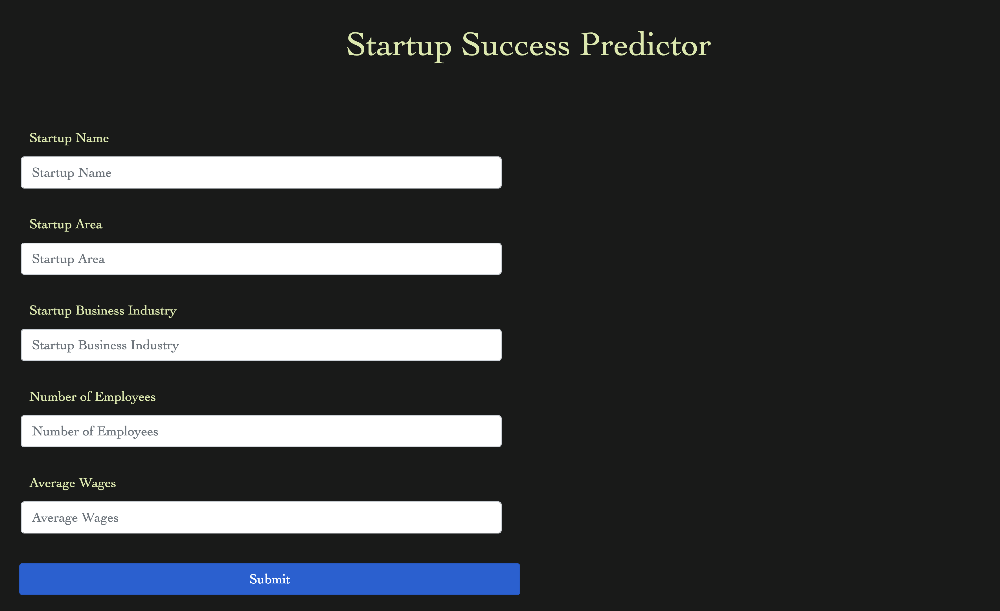

### Data in Cloud




### Sample Workspace
```python3 -m venv venv```  
```. venv/bin/activate```  
```python3 -m pip install -r requirements.txt```  
```python3 -m pip freeze > requirements.txt```  